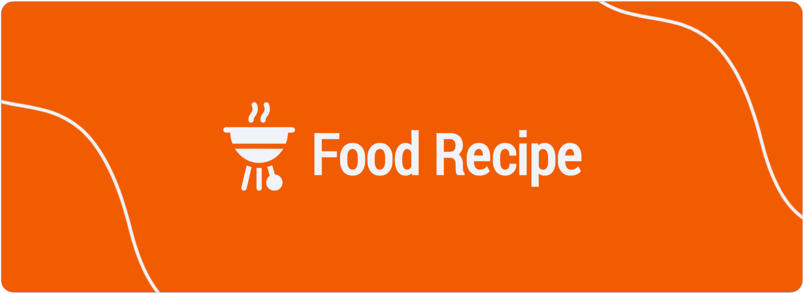

<!-- HEADER -->
<div align="center">

# 🥗 Food Recipe

</div>

<!-- BANNER -->


<div align="center">

<a href="https://food-recipe-mocha.vercel.app/" align="center"><strong>➥ Live Demo</strong></a> 

</div>

<!-- CONTENT -->
<!-- About The Project -->
## About The Project
Food Recipe is a web-based application that allows users to search for food recipes and add their own recipes to this application.

### Built With
This app was built with some technologies below:
<br />


<!-- Getting Started -->
## Getting Started

### Prerequisites

This is an example of how to list things you need to use the software and how to install them.

* [Node.js](https://nodejs.org/en/download/)
* [React.js](https://reactjs.org/docs/create-a-new-react-app.html)

### Installation

- Clone the repository
```
git clone https://github.com/MaulanaIsmail26/food-recipe-fe.git
```
- Go to repository folder
```
cd food-recipe-fe
```
- Install Module
```
npm install / npm i
```
- Connect with database
- Setup .env
```env
# app
REACT_APP_URL_BACKEND = [API_URL]
REACT_APP_IS_MAINTENANCE= false [is true if you make improvements or developments]
```
- Type `npm run build` To Start Development
- Type `npm run start` To Start Production

<!-- ### Setup .env example

Create .env file in your root project folder.

```env
# app
NEXT_PUBLIC_BACKEND_URL = [API_URL]
``` -->

<!-- Contributing -->
<!-- ## Contributing

Contributions are what make the open source community such an amazing place to be learn, inspire, and create. Any contributions you make are **greatly appreciated**.

1. Fork the Project
2. Create your Feature Branch (`git checkout -b feature/AmazingFeature`)
3. Commit your Changes (`git commit -m 'Add some AmazingFeature'`)
4. Push to the Branch (`git push origin feature/AmazingFeature`)
5. Open a Pull Request -->

<!-- Demo -->
## Demo

